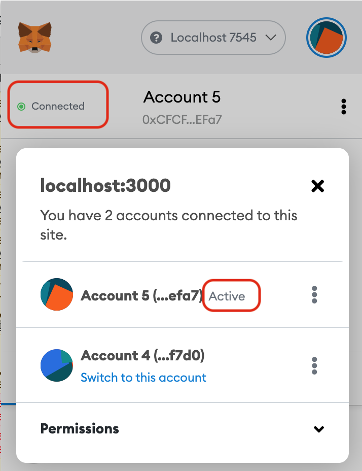

===== ETHEREUM TODO LIST =====

# Tutorial video link
```
https://youtu.be/coQ5dg8wM2o
```

# Setup
```
npm install -g truffle
npm i
rm -fr ./build
truffle compile
truffle migrate
npm run dev
```

# Metamask setup
Make sure to connect the account to metamask and metamask account to localhost server


# Browser
Go to http://localhost:3000